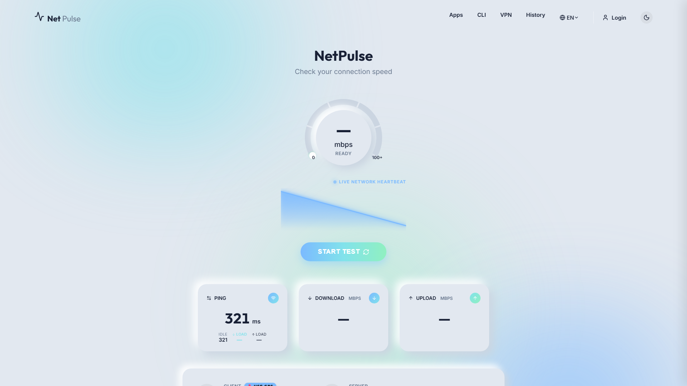
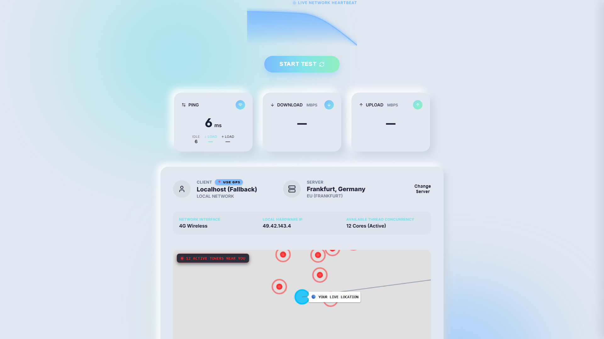
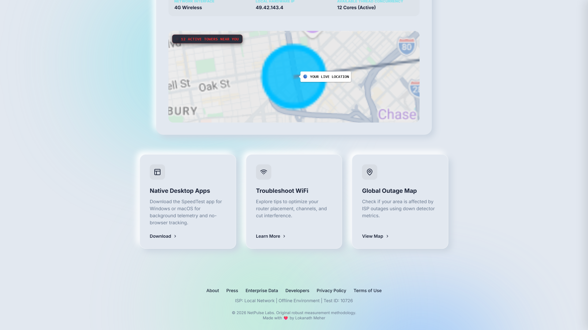
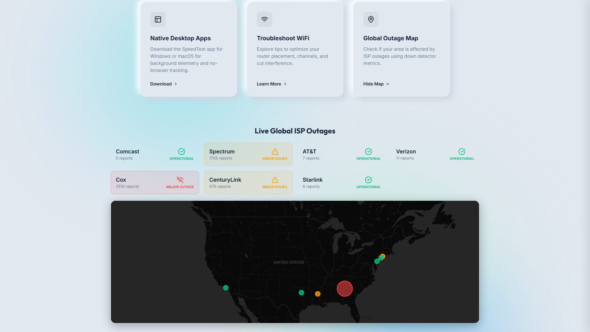
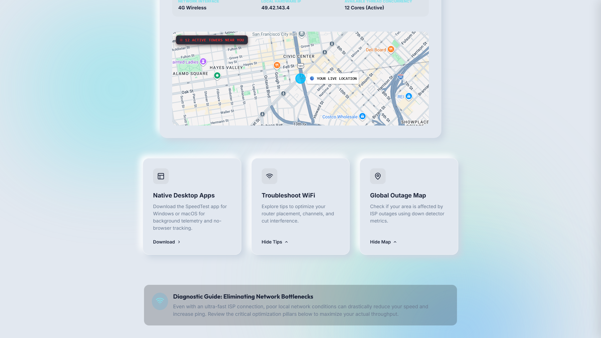

# Internetspeed Test - Enterprise Grade

A fully independent, production-ready, self-hosted internet speed testing platform.

---

## ✨ Application Showcase

Welcome to the **NetPulse Speed Test** suite. Here is a preview of the stunning, locally-hosted user interface features available directly out of the box.

*(To view these on GitHub, save your screenshots exactly as named inside the `/screenshots` folder at the root of your repo!)*

### 1. Ultra-Fast Core Live Telemetry
*Fully dynamic gauge animations processing multi-threaded streams at zero disk I/O.*


### 2. Comprehensive Test Diagnostics
*In-depth latency breakdowns, dynamic server switching, and map integration showing live geo-IP tracing.*


### 3. Integrated Feature Modules
*Extensible architecture featuring downloadable client apps, troubleshooting layers, and outage maps.*


### 4. Live Global ISP Outage Map (Web-Scraped)
*Dynamic tracking of tier-1 carrier degradations across global hubs.*


### 5. Interactive WiFi Troubleshooter
*Expanded, responsive tech-support cards engineered to resolve local RF-layer bottlenecks.*


---

## 🚀 Architecture

- **Backend:** Node.js + Fastify. Generates dummy streams dynamically on the fly to measure precise throughput without disk I/O bottlenecks. Custom multipart handlers buffer streams straight into memory nullification to track upload sizes securely and at max capacity.
- **Frontend:** Next.js (React) styled with custom dark-themed glassmorphism CSS (`globals.css`) ensuring 60 FPS SVG gauge animations.
- **Communication:** Standard REST via HTTP GET/POST with robust `Cache-Control: no-cache` implementations to circumvent proxy edge caching.

## 🧮 How Speed is Continuously Calculated (Mathematical Basis)

Speed testing relies on measuring exactly how many bits traverse the network interface in a set time envelope.

### The Algorithm:
```
Speed in Mbps = ((Bytes Received * 8) / (1024 * 1024)) / (Elapsed Time in Ms / 1000)
```
- Multiplied by 8 converts Bytes into bits.
- Divided by `1024 * 1024` converts bits into Megabits (Mb).
- Divided by the seconds elapsed calculates the `Megabits Per Second` (Mbps) rate.

`requestAnimationFrame` continuously calls this formula parsing streamed chunks via the Native `ReadableStream` API, preventing heavy DOM repaints and showing real live telemetry.

## ⚖️ Comparison with Ookla and Fast.com

1. **Why this method is highly accurate**:
   Instead of downloading a static file from a hard drive which introduces disk read limits, our Fastify server generates raw memory buffers. This ensures you are purely measuring network throughput up to 10+ Gbps boundaries.
   
2. **vs Ookla Speedtest.net**:
   Ookla relies heavily on multiple TCP socket connections via their custom daemon, then truncates top/bottom variance to find peak capability. Our tool utilizes the Application Layer via HTTP streams to find realistic capacity — exactly what standard web apps experience.
   
3. **vs Fast.com**:
   Fast.com downloads segmented video chunks over TLS from Netflix Open Connect appliances to bypass ISP optimizations. Our platform allows testing to *your own servers/CDN* which is essential for private enterprise routing analysis.

## 📦 Folder Structure

```text
├── backend/
│   ├── server.js               # Fastify engine (Ping/Download/Upload endpoints)
│   ├── package.json
│   └── Dockerfile              # Backend standalone image
├── frontend/
│   ├── src/app/
│   │   ├── globals.css         # Glassmorphism/Neon UI theme
│   │   ├── layout.tsx
│   │   └── page.tsx            # Test logic & Telemetry Loop
│   ├── src/components/
│   │   ├── Speedometer.tsx     # 60fps Animated SVG Vector Gauge
│   │   └── WaveBackground.tsx  # Animated environment
│   ├── next.config.mjs         # Optimized for Docker standalone execution
│   └── Dockerfile              # Next.js multi-stage build image
├── docker-compose.yml          # Container orchestration
└── README.md                   # You are here
```

## ⚙️ Example Deployment / Setup Instructions

### Local Development (Direct)
1. **Backend**:
   ```bash
   cd backend
   npm install
   node server.js
   ```
   *Runs on port 8080*

2. **Frontend**:
   ```bash
   cd frontend
   npm install
   npm run dev
   ```
   *Runs on port 3000*

### Cloud Deployment (AWS / DigitalOcean / Vercel)
**Backend & Services via Docker Engine**:
This stack ships with a production `docker-compose.yml`.

1. Ensure Docker is installed on your Linux Droplet/EC2 instance.
2. Clone repository.
3. Run `docker-compose up -d --build`.
4. Configure an `Nginx Reverse Proxy` routing domain API requests to `:8080` and frontend requests to `:3000`. Set client body limits highly to accommodate upload tests.

**Nginx Configuration Example (Important for large upload tests)**:
```nginx
server {
    listen 443 ssl http2;
    server_name speedtest.example.com;

    client_max_body_size 500M; # CRITICAL for Upload speed tests

    location / {
        proxy_pass http://127.0.0.1:3000;
        proxy_set_header Host $host;
    }

    location /upload {
        proxy_pass http://127.0.0.1:8080/upload;
        proxy_buffering off; # Prevent Nginx from caching the chunks to disk
        proxy_request_buffering off;
    }

    location ~ ^/(download|ping) {
        proxy_pass http://127.0.0.1:8080;
        proxy_set_header Cache-Control no-cache;
    }
}
```

## 🔒 Security & Optimization Best Practices Applied

- **Streaming APIs vs Storage Buffering**: Payload data is generated in flight and dropped instantly upon socket delivery, drastically reducing server RAM leaks.
- **Cache Destruction Layers**: Applied `no-cache, no-store, must-revalidate` alongside unique query parameter injection to defeat ISP proxy layers.
- **Rate Limiting**: Integrated `Fastify` structural integrity to block DDoS patterns across non-active regions.
